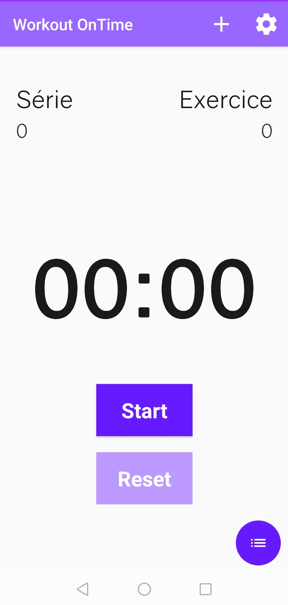
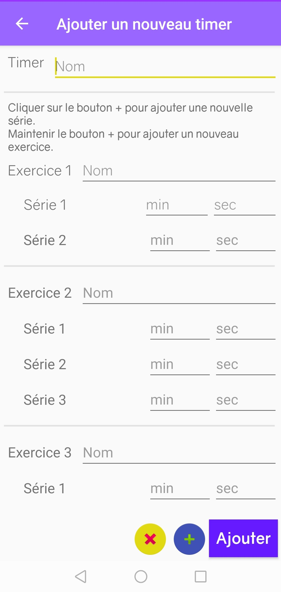
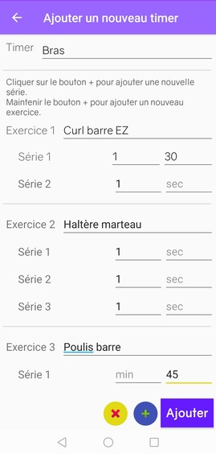
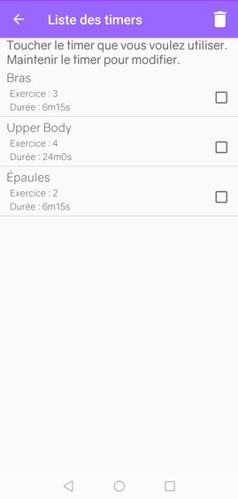
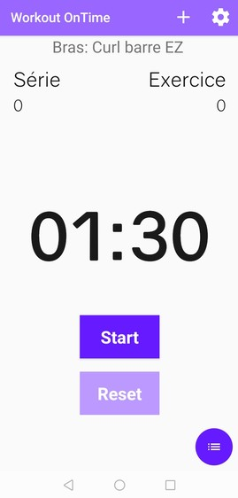
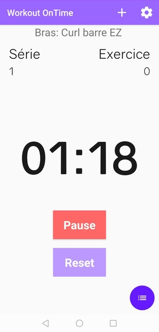
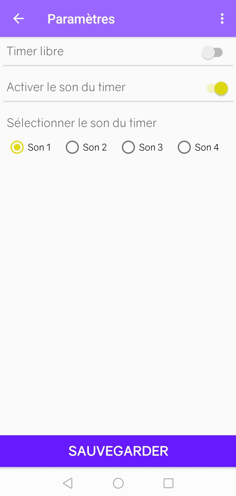
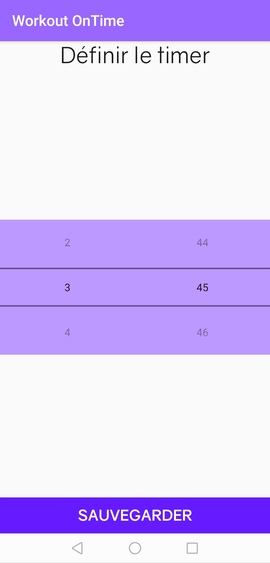
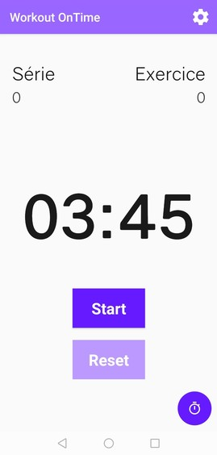

# WorkoutOnTime

## Introduction

**Workout OnTime** est issue d'un projet de DUT Informatique permettant de valider le module *Conception d'application Android* de 2e année. Il a été développé par __Rainui LY__.

### Pour qui ?

Cette application est destiné à tous pratiquants d'un sport nécéssitant des **temps de repos**. Lorsqu'on pratique la musculation par exemple, il est important de respecter ses temps repos pour garantir des résultats optimaux. 

### But

Cependant, ses temps de repos varient en fonction des exercices, du types d'entrainement suivis (statique, pyramidale, dégressif...) voire du programme établit par un coach sportif. **Workout OnTime** répond donc à ce problème en permettant à l'utilisateur d'enregistrer en amont ses programmes contenant le nom de la séance, les exercices, le nombre de série par exercices et le temps de repos de chaques séries.

De cette manière, l'utilisateur ne s'embêtera plus à régler à la main, après chaque exercice/série, son temps de repos. **Workout OnTime** s'en charge! De même, il s'occupe de compter le nombre d'exercice et série réalisé afin de vous eviter de perdre le compte. ;)

## Fonctionnalités

### Page de démarrage

### Création d'un timer

### Sélection d'un timer

### Lancement du timer sélectionné

### Les paramètres

### Mode libre activé

