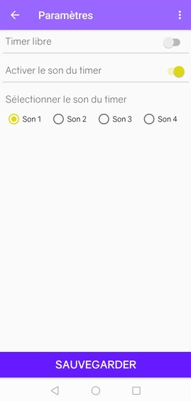

# WorkoutOnTime

## Introduction

Workout OnTime est issu d'un projet de DUT Informatique du module *Conception d'application Android* de 2e année. La durée imposée fut de 7,5h avant l'évaluation de ce dernier. Le projet est entièrement développé par Rainui LY et a obtenu la note de 19/20.

### Pour qui ?

Cette application est destinée à tous les pratiquants d'un sport nécessitant des temps de repos. Lorsqu'on pratique la musculation par exemple, il est important de respecter ces temps de repos pour garantir des résultats optimaux. 

Cependant, ces temps de repos varient en fonction des exercices, du type d'entrainement suivi (statique, pyramidale, dégressif...) voire du programme établit par un coach sportif.

### But

Workout OnTime répond donc à ce problème en permettant à l'utilisateur d'enregistrer en amont ses programmes contenant le nom de la séance, les exercices, le nombre de séries par exercice et le temps de repos de chaque série.

De cette manière, l'utilisateur ne s'embêtera plus à régler à la main, après chaque exercice/série, son temps de repos. Workout OnTime s'en charge ! De même, il s'occupe de compter le nombre d'exercices et séries réalisés afin de vous éviter de perdre le compte. ;)

### Technologies utilisées

L'utilisation d'Android Studio à faciliter le développement de Workout OnTime.

Le développement du client a été fait sous Java (imposé) et l'interface graphique à été mis en place avec XML de manière statique et dynamiquement par Java. 

Le SDK 19 (KitKat) a été imposé.

## Présentation

### Page de démarrage

### Création d'un timer

### Sélection d'un timer

### Lancement du timer sélectionné

### Les paramètres

### Mode libre activé

